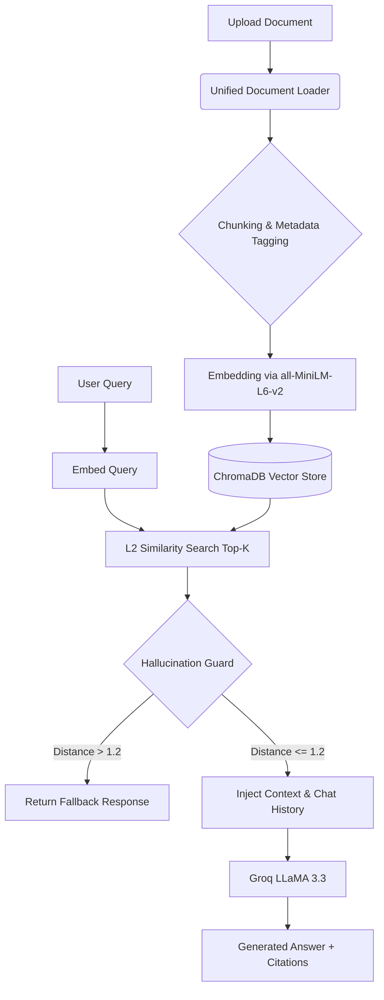

# 🚨 Disaster Management RAG Assistant


> **Project 5 – Disaster Management RAG Assistant**  
> An advanced Retrieval-Augmented Generation (RAG) system built for AI/ML internship submission. 

---

## 📖 1. Project Overview

The **Disaster Management RAG Assistant** is a production-ready conversational AI designed to ingest, process, and query critical disaster management documents (Standard Operating Procedures, emergency guidelines, risk assessments). 

It utilizes a modern **RAG (Retrieval-Augmented Generation)** architecture to ensure that all AI responses are strictly grounded in the provided official documents. The system supports multi-format document ingestion, semantic search via vector embeddings, and rigorous hallucination prevention, making it highly reliable for critical information retrieval.

---

## ✨ 2. Features

- **Multi-Format Ingestion:** Seamlessly processes PDF, Markdown, CSV, and Excel files.
- **Auto-Ingestion:** Automatically recursively scans and indexes documents placed in the `server/documents/` directory on startup.
- **Conversational Memory:** Retains chat history context for multi-turn conversations.
- **Source Citations:** Transparently provides the exact document name, page number, and section heading for every answer generated.
- **Strict Hallucination Guard:** Bypasses LLM generation and returns a safe fallback if retrieved context falls below similarity thresholds.
- **AI Document Summarization:** Generates high-level structured summaries of entire documents.
- **Automated Evaluation Suite:** Built-in benchmarking script (`evaluate.py`) to test retrieval accuracy and generation quality against a baseline dataset.

---

## 🛠️ 3. Tech Stack

### Frontend
- **React.js** (v18)
- **Vite** (Build Tool)
- **Tailwind CSS** (Styling)
- **Axios** (API Client)

### Backend & AI
- **FastAPI** (High-performance API framework)
- **LangChain** (LLM orchestration)
- **ChromaDB** (Local Vector Database)
- **HuggingFace** (`all-MiniLM-L6-v2` for embeddings)
- **Groq API** (`llama-3.3-70b-versatile` for generation)
- **Loaders:** `PyPDFLoader`, `CSVLoader`, `UnstructuredMarkdownLoader`, `UnstructuredExcelLoader`

---

## 🏛️ 4. Architecture

The system follows a decoupled client-server architecture:
1. **React Client:** Provides an intuitive dashboard for chatting, uploading documents, viewing citations, and running evaluations.
2. **FastAPI Server:** Exposes RESTful endpoints for document management, RAG querying, and summarization.
3. **Vector Store:** ChromaDB persists embeddings locally in SQLite for rapid semantic retrieval.
4. **LLM Engine:** Groq API provides ultra-low latency inference using LLaMA 3.

---

## 🔄 5. RAG Workflow



---

## 📂 6. Project Structure

```text
├── client/                          # React Frontend
│   ├── src/
│   │   ├── components/              # Chat, Upload, Evaluation UI
│   │   ├── pages/                   # Main Layouts
│   │   └── services/                # Axios API handlers
│   └── package.json
│
├── server/                          # FastAPI Backend
│   ├── documents/                   # Document storage (auto-ingested)
│   │   ├── pdf/                     # PDF files
│   │   ├── markdown/                # MD files
│   │   ├── csv/                     # CSV files
│   │   ├── excel/                   # XLSX files
│   │   └── test_questions.csv       # Sample evaluation dataset
│   ├── modules/
│   │   ├── llm.py                   # Groq LLM + System Prompts
│   │   ├── load_vectorstore.py      # Unified multi-format loader
│   │   └── query_handlers.py        # Retrieval + Hallucination guard
│   ├── evaluate.py                  # Standalone evaluation script
│   ├── main.py                      # FastAPI routes
│   └── requirements.txt
```

---

## ⚙️ 7. Installation

### Prerequisites
- Python 3.9+
- Node.js 18+
- [Groq API Key](https://console.groq.com/)

### Clone the Repository
```bash
git clone <repository-url>
cd Disaster-Management-RAG-Assistant
```

---

## 🔐 8. Environment Variables

Create a `.env` file in the `server/` directory:

```env
# server/.env
GROQ_API_KEY=your_groq_api_key_here
CHROMA_DB_PATH=./chroma_db
```

---

## 💻 9. Running Frontend

Open a new terminal window:

```bash
cd client
npm install
npm run dev
```
The application will be available at `http://localhost:5173`.

---

## 🚀 10. Running Backend

Open a new terminal window:

```bash
cd server
python -m venv venv
source venv/Scripts/activate  # On Windows Git Bash
# OR: source venv/bin/activate # On Linux/Mac

pip install -r requirements.txt
python -m uvicorn main:app --reload
```
The API documentation (Swagger UI) will be available at `http://127.0.0.1:8000/docs`.

---

## 📊 11. Running Evaluation

The system includes a benchmarking script to test retrieval accuracy. 

```bash
cd server
source venv/Scripts/activate
python evaluate.py
```
This script reads `server/documents/test_questions.csv`, queries the vector database, and generates an `evaluation_report.md` containing the expected topic, generated answer, and retrieved chunks with similarity scores.

---

## ❓ 12. Sample Questions

Try these queries once you have ingested disaster management documents:
1. *What are the key phases of the disaster management cycle?*
2. *What actions should be taken immediately after an earthquake?*
3. *How should communities be evacuated during a flood warning?*
4. *What items should be included in a basic emergency preparedness kit?*
5. *What are the primary responsibilities of first responders in a disaster?*

---

## 🧩 13. Chunking Strategy

To maintain context during vectorization, documents are processed using LangChain's `RecursiveCharacterTextSplitter`:
- **Chunk Size = 500 characters**: Approximates one semantically complete paragraph of procedural text, ensuring the LLM receives focused, relevant information.
- **Chunk Overlap = 100 characters**: A ~20% overlap ensures that critical instructions (e.g., evacuation routes) split across chunk boundaries are preserved, preventing context loss.

**Metadata Extraction:** Every chunk is tagged with `filename`, `page`, `section` (if markdown), `doc_type`, and `chunk_id`.

---

## 🔍 14. Retrieval Strategy

The system utilizes **ChromaDB** for local vector storage, embedding text via the `all-MiniLM-L6-v2` SentenceTransformer model (384-dimensional dense vectors). 
- **Distance Metric:** L2 (Euclidean) Distance.
- **Top-K Retrieval:** Configurable `k=5` (default). The system fetches the 5 most semantically similar chunks to the user's query to build the context window.

---

## 🛡️ 15. Hallucination Prevention

In mission-critical domains like Disaster Management, preventing AI hallucinations is paramount. We employ a two-tier prevention strategy:

1. **Pre-generation Thresholding:** The system evaluates the L2 distance of retrieved chunks. If the best retrieved chunk has an L2 distance score `> 1.2` (indicating poor relevance), the LLM is bypassed entirely. The system returns a hardcoded safe response: *"I couldn't find this information in the provided disaster management documents."*
2. **Prompt Engineering:** The `ChatGroq` prompt strictly instructs the LLaMA model to *only* use provided context, never invent information, and accurately cite the document metadata.

---

## 📈 16. Evaluation Methodology

The `evaluate.py` script and the React "Evaluate" dashboard validate system robustness:
1. **Test Dataset:** A curated CSV (`test_questions.csv`) containing domain-specific questions and expected topics.
2. **Execution:** The script iteratively queries the `/ask/` endpoint.
3. **Reporting:** Generates a markdown report logging the raw query, the LLM's answer, and a trace of all retrieved chunks alongside their L2 distance scores. This allows developers to manually verify if the correct document sections were retrieved and if the hallucination guard triggered appropriately.

---

## 🔮 17. Future Improvements

- [ ] **Hybrid Search:** Implement BM25 + Vector Search for improved keyword matching alongside semantic search.
- [ ] **Reranking:** Integrate Cohere or Cross-Encoder models to re-rank Top-K results for higher precision.
- [ ] **OCR Support:** Integrate Tesseract to process scanned, non-searchable PDF images.
- [ ] **DOCX & PPTX Support:** Expand the unified loader to handle Word documents and PowerPoint slides.
- [ ] **Multi-User Authentication:** Implement JWT-based login for secure, user-specific chat histories.
- [ ] **WebSockets:** Transition to WebSocket streaming for token-by-token LLM generation response UI.
